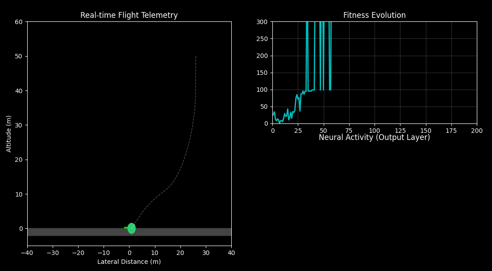

Project Aether: Autonomous Atmospheric Entry System
===================================================

Project Aether is a "bare metal" implementation of Neuro-Evolutionary Reinforcement Learning written in pure Python. It demonstrates how complex adaptive behaviors can emerge from first principles without relying on high-level Machine Learning libraries like TensorFlow, PyTorch, or Gymnasium.

The project features a custom-built physics engine simulating a Mars-like environment, a scratch-written dense neural network, and an adaptive genetic algorithm that optimizes flight controllers in real-time.



🚀 Key Features
---------------

-   **Zero ML Dependencies:** The Neural Network logic (forward pass, weights, biases, activation functions) is implemented entirely using NumPy matrix operations.

-   **Custom Physics Engine:** Simulates gravity ($g = -3.71 m/s^2$), atmospheric turbulence, fuel consumption, and rotational inertia.

-   **Adaptive Genetic Algorithm:**

    -   **Elitism:** Preserves the top 20% of performing agents.

    -   **Dynamic Mutation:** Automatically adjusts mutation rates based on population stagnation (simulated annealing logic).

-   **Real-time Visualization:** A custom Matplotlib dashboard that renders the lander, thrust plumes, trajectory history, and fitness telemetry live during training.

🛠️ Installation
----------------

This project requires **Python 3.7+**.

1.  **Clone the repository:**

    ```
    git clone https://github.com/mh-bagheri/project-aether.git
    cd project-aether
    ```

2.  Install dependencies:

    The only external dependencies are numpy for math and matplotlib for visualization.

    ```
    pip install numpy matplotlib
    ```

🎮 Usage
--------

Run the simulation directly from the terminal:

```
python aether_lander_ai.py
```

### What to Expect

1.  **Generation 0-10:** The landers will likely crash immediately or spin out of control. This is normal; they are initialized with random neural weights.

2.  **Generation 20-40:** You will observe "hovering" behaviors emerging as the agents learn that staying in the air yields higher rewards than crashing.

3.  **Generation 50+:** The agents will begin to master lateral movement, steering towards the green landing pad while managing vertical velocity for a soft touchdown.

🧠 System Architecture
----------------------

### 1\. The Agent (Lander)

-   **Sensors (Input Layer):** 6 inputs

    -   Horizontal Position ($x$)

    -   Vertical Position ($y$)

    -   Horizontal Velocity ($v_x$)

    -   Vertical Velocity ($v_y$)

    -   Angle ($\theta$)

    -   Fuel Level

-   **Actuators (Output Layer):** 2 outputs

    -   Main Thruster Power ($0$ to $100\%$)

    -   Reaction Control System (Rotate Left/Right)

### 2\. The Brain (Neural Network)

-   **Architecture:** Dense Feed-Forward

-   **Topology:** `6 inputs -> 16 hidden -> 12 hidden -> 2 outputs`

-   **Activation Functions:** `Tanh` (Hyperbolic Tangent) is used for the output layer to allow for negative values (rotation) and organic control curves.

### 3\. The Evolutionary Engine

Instead of Backpropagation (Gradient Descent), this project uses **Genetic Algorithms**:

1.  **Population:** 50 agents are spawned per generation.

2.  **Evaluation:** Each agent flies a simulation until it lands, crashes, or runs out of fuel.

3.  Fitness Calculation:

    $$Fitness = (100 - Distance) + (LandingBonus) + (FuelRemaining) - (CrashPenalty)$$
4.  **Selection:** Tournament selection chooses parents for the next generation.

5.  **Crossover & Mutation:** Weights are mixed and randomly perturbed.

📄 License
----------

This project is open-source and available under the MIT License.